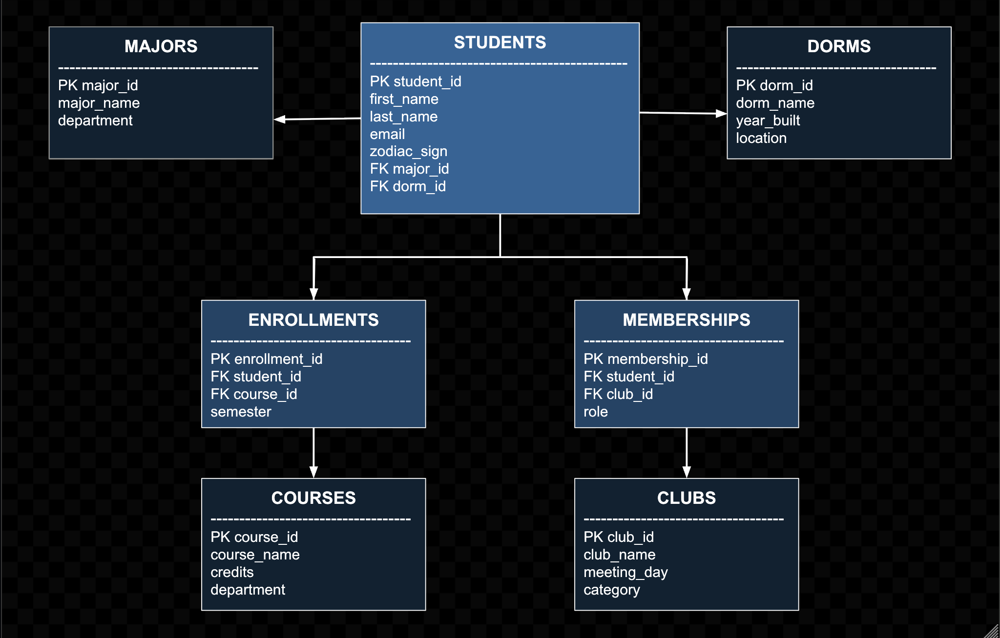

# Forge Software Engineering Deliverables

This repository contains the coding challenges and written deliverables for the Forge Software Engineering application.

[View the Part 1 Coding Challenges Here](challenges.js)

## Part 1: Relational Database Design

### Overall Design Goal
[cite_start]For this database, my main goal would be to store the data efficiently while avoiding any duplication or repeated data[cite: 517]. [cite_start]If I store all the data in one large table, I would end up duplicating the same data over and over[cite: 518]. [cite_start]For instance, I would have to write the text "Computer Science" over and over for every Computer Science major[cite: 519]. [cite_start]If I had to change something like a department name, I would have to change it everywhere, which is incredibly inefficient[cite: 520]. 

[cite_start]To get around this, I would use a relational database[cite: 521]. [cite_start]This makes it so I can have the data split up in different tables, with keys to connect the tables[cite: 522]. [cite_start]This way, I can have the data in one place and then use it when I need it[cite: 523].

### Core Tables
* [cite_start]**Students Table:** I would include data in this table such as the student's name, email, phone number, zodiac sign, and IDs of the student's major and dorm[cite: 529]. [cite_start]I would not include the actual major or dorm in this table, only IDs that point to another table containing this data[cite: 530].
* [cite_start]**Majors Table:** I would include data in this table such as the actual major and department of the major[cite: 531]. [cite_start]Each major would only be in this table once, and many students could reference them[cite: 532].
* [cite_start]**Dorms Table:** I would include data in this table such as the dorm name, its location, and the year it was built[cite: 533]. [cite_start]Many students could reference each dorm[cite: 534].

### Handling Classes and Clubs (Many-to-Many Relationships)
[cite_start]Some relationships can be complicated[cite: 536]. [cite_start]A student can be enrolled in many classes, and a class can have many students[cite: 536]. [cite_start]The same is true for clubs[cite: 537]. [cite_start]To handle these cases, I would use connector tables[cite: 537].
* [cite_start]**Enrollments Table:** This table will connect students to classes[cite: 538]. [cite_start]Each record will represent one student taking one class[cite: 538]. [cite_start]This will prevent the need to include class information inside the Students table[cite: 539].
* [cite_start]**Memberships Table:** This table will connect students to clubs[cite: 540]. [cite_start]This table can include additional information, such as the student's position in the club[cite: 540].

### Database Schema Diagram

---

## Part 1 Questions

**1. Resources Used**
[cite_start]I primarily utilized the MDN Web Docs (Mozilla Developer Network) to learn JavaScript syntax, specifically methods like unshift(), splice(), and sort()[cite: 577]. [cite_start]I also used the ES6 Coding Style page on GitHub in order to make sure I was writing in the correct format[cite: 578]. [cite_start]I used Gemini to come up with the plaindrome edge case with punctuation: "A man, a plan, a canal: Panama" I did this because I couldn't come up with any good, long palindromes that also included punctuation. Additionally, I used Stack Overflow to learn about the regex `/[^a-z0-9]/g` and how it can be used to identify anything that isn't a number or letter.

**2. Time Spent**
[cite_start]About 6 hours total, including implementation, testing, debugging, and documentation[cite: 582].

**3. Relevant Coursework**
* [cite_start]**Computer Science:** CS 3140: Software Development Essentials, CS 2130: Computer Systems and Organization, CS 2100: Data Structures and Algorithms, CS 2120: Discrete Mathematics and Theory, CS 1501: Special Topics: Cracking the Coding Interview, CS 1110: Introduction to Programming[cite: 586, 587, 588, 589, 590, 591].
* [cite_start]**Statistics & Mathematics:** STAT 3220: Regression Analysis, STAT 3080: From Data to Knowledge, MATH 3351: Elementary Linear Algebra, MATH 3250: Ordinary Differential Equations, MATH 3100: Introduction to Probability[cite: 594, 595, 596, 597].

---

## Part 2 Essays

**What's something we wouldn't know about you just by looking at your resume?**
[cite_start]I love video games, but I've always treated them as more than just entertainment; to me, they're essentially logic puzzles[cite: 601]. [cite_start]In Civilization VI, I once challenged myself to win a science victory, which means winning the in-game space race, by intentionally keeping my empire small[cite: 602]. [cite_start]It forced me to obsess over resource efficiency and plan dozens of turns ahead, and by the end, I successfully conquered Mars[cite: 603]. [cite_start]I get a similar feeling in Minecraft, where I build automated farms using Redstone[cite: 604]. It's basically visual coding; [cite_start]I have to design a system, test the circuits, and fix the bugs when things don't work. Even Baldur's Gate 3 taught me about risk management; you have to plan your strategy assuming the dice might roll a 1[cite: 606]. [cite_start]These experiences keep my brain active and train the same analytical muscles I use for software engineering[cite: 606].

**What are you looking for in an internship?**
[cite_start]I'm looking for an internship where I can apply what I've learned so far in class to something that actually matters[cite: 609]. [cite_start]I'm passionate about working on messy problems that don't necessarily have a clear solution, because I know that's where I can really learn[cite: 610]. [cite_start]I'm also eager to work with a team because my first group programming project in Software Development Essentials taught me that great software is rarely built alone[cite: 611]. [cite_start]I'm hoping that I can contribute to a codebase, learn professional workflows like code reviews, and be mentored by someone who will encourage me to think outside the box[cite: 612]. [cite_start]Most of all, I'm hoping that I can gain some skills and experiences that are actually applicable outside of the classroom[cite: 613].
